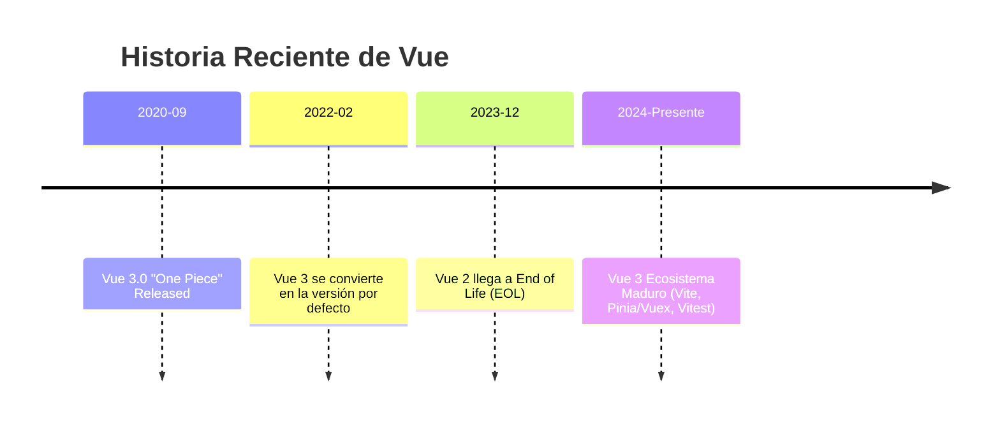

# TFG UNIR - Frontend Vue3

[](https://sonarcloud.io/summary/new_code?id=isidromerayo_TFG_UNIR-vue3)
[](https://sonarcloud.io/summary/new_code?id=isidromerayo_TFG_UNIR-vue3)
[](https://sonarcloud.io/summary/new_code?id=isidromerayo_TFG_UNIR-vue3)
[](https://sonarcloud.io/summary/new_code?id=isidromerayo_TFG_UNIR-vue3)
[](https://sonarcloud.io/summary/new_code?id=isidromerayo_TFG_UNIR-vue3)
[](https://sonarcloud.io/summary/new_code?id=isidromerayo_TFG_UNIR-vue3)

Aplicación web frontend desarrollada en Vue 3 con Vite para un sistema de gestión de cursos online.

> 📊 **Estado de Cobertura**: El proyecto mantiene un objetivo de cobertura superior al **80% en código nuevo**, validado a través de SonarQube, utilizando una combinación de Vitest para lógica/estructura y Cypress para componentes críticos.

## 🚀 Tecnologías

- **Framework**: Vue 3.5.26
- **Build Tool**: Vite 7.3.0
- **Language**: TypeScript 5.9.2 (Strict Mode)
- **Package Manager**: pnpm
- **Router**: Vue Router 4.6.4
- **State Management**: Pinia 3.0.4
- **HTTP Client**: Axios 1.10.0
- **UI/Alerts**: SweetAlert2 11.26.17
- **Testing**: Vitest + Testing Library, Cypress (E2E & Component Testing)

## 📦 Instalación

### Prerequisitos

- Node.js 20.x o superior
- pnpm 8.0.0 o superior

### Instalar pnpm

```bash
npm install -g pnpm
```

### Instalar Dependencias

```bash
pnpm install
```

## 🛠️ Desarrollo

### Servidor de Desarrollo

```bash
pnpm dev
```

Abre [http://localhost:5173](http://localhost:5173) en tu navegador.

### Build de Producción

```bash
pnpm build
```

### Preview del Build

```bash
pnpm preview
```

### Type Checking

```bash
pnpm type-check
```

### Linter

```bash
pnpm lint
```

### Formatter

```bash
pnpm format
```

## 🧪 Testing

### Tests Unitarios

```bash
# Con watch mode
pnpm test:unit

# Headless (CI/CD)
pnpm test-headless

# Con coverage
pnpm test-headless-cc
```

### Tests E2E (Cypress)

```bash
# Interactivo
pnpm cypress:open

# Headless
pnpm cypress:run

### Tests de Componentes (Cypress)

```bash
# Interactivo
pnpm cypress:component:open

# Headless
pnpm cypress:component
```
```

## 📁 Estructura del Proyecto

```
TFG_UNIR-vue3/
├── src/
│   ├── assets/          # Recursos estáticos
│   ├── components/      # Componentes Vue
│   ├── model/          # Modelos de datos
│   ├── router/         # Configuración de rutas
│   ├── services/       # Servicios API
│   ├── stores/         # Pinia store
│   ├── types/          # Tipos & Interfaces TypeScript
│   ├── utils/          # Utilidades
│   ├── views/          # Vistas/Páginas
│   ├── App.vue         # Componente raíz
│   └── main.ts         # Punto de entrada
├── tests/              # Tests unitarios
├── cypress/            # Tests E2E
└── public/             # Assets públicos
```

## 🔧 Scripts Disponibles

| Script | Descripción |
|--------|-------------|
| `pnpm dev` | Servidor de desarrollo |
| `pnpm build` | Build de producción |
| `pnpm preview` | Preview del build |
| `pnpm type-check` | Verificación de tipos |
| `pnpm test:unit` | Tests con watch mode |
| `pnpm test-headless` | Tests headless |
| `pnpm test-headless-cc` | Tests con coverage |
| `pnpm lint` | Linter con autofix |
| `pnpm format` | Formatter |

## 📚 Documentación

- **[AGENTS.md](./AGENTS.md)** - Contexto completo del proyecto para agentes IA
- **[PULL_REQUEST.md](./PULL_REQUEST.md)** - Documentación de la PR

## 🔒 Seguridad y Mantenimiento

### Auditoría de Seguridad

```bash
# Verificar vulnerabilidades
pnpm audit

# Auditoría con detalles en JSON
pnpm audit --json

# Auditoría con nivel específico
pnpm audit --audit-level=moderate
```

**Estado actual**: ✅ 0 vulnerabilidades conocidas

⚠️ **Importante**: `pnpm audit` solo consulta la npm Advisory Database. Para una seguridad completa, usa el script multi-herramienta:

```bash
pnpm security
```

### Verificar Dependencias Desactualizadas

```bash
# Ver todas las dependencias desactualizadas
pnpm outdated

# Ver solo dependencias de producción
pnpm outdated --prod

# Ver en formato JSON
pnpm outdated --json
```

### Actualizar Dependencias

```bash
# Actualizar todas (respetando semver en package.json)
pnpm update

# Actualizar a últimas versiones (ignora semver)
pnpm update --latest

# Actualizar una dependencia específica
pnpm update <package>

# Actualizar dependencias interactivamente
pnpm update --interactive
```

**Después de actualizar, siempre verificar**:
```bash
pnpm type-check
pnpm lint
pnpm test-headless
pnpm build
```

## 🚀 CI/CD

### GitHub Actions

El proyecto incluye workflows de CI/CD configurados en `.github/workflows/`:

#### Pipeline de Tests (tests.yml)

Se ejecuta automáticamente en:
- Push a `main`, `develop`
- Pull requests a `main`, `develop`

**Pasos**:
1. **Unit Tests (Vitest)**: Ejecuta tests unitarios con cobertura.
2. **Component Tests (Cypress)**: Ejecuta tests de componentes en aislamiento.
3. **E2E Tests (Cypress)**: Ejecuta tests de extremo a extremo sobre el build de producción.
4. **Coverage Report**: Fusiona los reportes de Vitest y Cypress para un reporte unificado.

#### Pipeline Principal (node.js.yml)

**Pasos**:
1. **Checkout** - Descarga el código
2. **Setup Node.js** - Configura Node.js 20.x
3. **Install pnpm** - Instala pnpm 10.x
4. **Cache** - Cachea el store de pnpm
5. **Install** - Instala dependencias con `--frozen-lockfile`
6. **Type Check** - Verifica tipos TypeScript
7. **Build** - Compila el proyecto
8. **Test** - Ejecuta tests con coverage
9. **Audit** - Verifica vulnerabilidades

#### Security Workflow (security.yml)

Auditoría de seguridad multi-herramienta:
- Ejecución diaria automática (2 AM UTC)
- Ejecución en push/PR
- 5 herramientas: pnpm audit, npm audit, Snyk, OSV Scanner, outdated check
- Generación de reportes y alertas automáticas

**Beneficios**:
- ✅ Builds reproducibles con lockfile congelado
- ✅ Instalación rápida con caché de pnpm
- ✅ Verificación automática de calidad de código
- ✅ Detección temprana de errores y vulnerabilidades

## 🔄 Migración a pnpm

Este proyecto ha sido migrado de npm a pnpm.

### Ejecutar Migración

```bash
chmod +x migrate-to-pnpm.sh
./migrate-to-pnpm.sh
```

### Comandos Equivalentes

| npm | pnpm |
|-----|------|
| `npm install` | `pnpm install` |
| `npm install <pkg>` | `pnpm add <pkg>` |
| `npm install -D <pkg>` | `pnpm add -D <pkg>` |
| `npm uninstall <pkg>` | `pnpm remove <pkg>` |
| `npm run <script>` | `pnpm <script>` |
| `npm update` | `pnpm update` |
| `npm audit` | `pnpm audit` |

## 🤝 Contribución

### Workflow de Desarrollo

1. Crear rama para tu feature
2. Hacer cambios
3. Ejecutar type check: `pnpm type-check`
4. Ejecutar linter: `pnpm lint`
5. Ejecutar tests: `pnpm test-headless`
6. Verificar build: `pnpm build`
7. Commit y push
8. Crear Pull Request

### Checklist Pre-Commit

- [ ] ✅ Type check pasa: `pnpm type-check`
- [ ] ✅ Linter pasa: `pnpm lint`
- [ ] ✅ Tests pasan: `pnpm test-headless`
- [ ] ✅ Build exitoso: `pnpm build`
- [ ] ✅ Sin vulnerabilidades: `pnpm audit`

## 💡 IDE Setup Recomendado

### VSCode

**Extensiones**:
- [Volar](https://marketplace.visualstudio.com/items?itemName=Vue.volar) - Vue 3 support
- [TypeScript Vue Plugin](https://marketplace.visualstudio.com/items?itemName=Vue.vscode-typescript-vue-plugin)
- [ESLint](https://marketplace.visualstudio.com/items?itemName=dbaeumer.vscode-eslint)
- [Prettier](https://marketplace.visualstudio.com/items?itemName=esbenp.prettier-vscode)

**Nota**: Desactiva Vetur si lo tienes instalado (incompatible con Volar)

### Type Support para `.vue` en TypeScript

TypeScript no puede manejar información de tipos para imports `.vue` por defecto. Usamos `vue-tsc` para type checking. En editores, necesitas Volar para que el servicio de lenguaje TypeScript reconozca los tipos `.vue`.

## 📅 Ciclo de Vida del Framework Vue

Actualmente, el ecosistema Vue se encuentra en una fase de madurez centrada en la versión 3.x, mientras que la versión 2.x ha llegado al final de su ciclo de vida.

### Estado de las Versiones

| Versión | Estado | Fecha de Lanzamiento | Fin de Soporte (EOL) |
|---------|--------|----------------------|----------------------|
| **Vue 3** | **Estable / Actual** | 18 de Septiembre 2020 | - |
| **Vue 2** | **End of Life (EOL)** | - | 31 de Diciembre 2023 |

> ⚠️ **Vue 2 EOL**: Desde el 31 de diciembre de 2023, Vue 2 ya no recibe nuevas funcionalidades, correcciones de errores ni parches de seguridad. Se recomienda encarecidamente migrar a Vue 3.

### Política de Lanzamientos

- **Versiones Menores**: Se lanzan aproximadamente cada 3-6 meses e incluyen nuevas funcionalidades no disruptivas.
- **Soporte LTS (Long Term Support)**: La última versión menor de una versión mayor (ej. 3.x) entra en soporte LTS por 18 meses (solo correcciones de seguridad) una vez que se lanza la siguiente versión mayor.

### Cronología



## 📖 Recursos

- [Vue 3 Documentation](https://vuejs.org/)
- [Vite Documentation](https://vitejs.dev/)
- [Vue Router Documentation](https://router.vuejs.org/)
- [Pinia Documentation](https://pinia.vuejs.org/)
- [Vitest Documentation](https://vitest.dev/)
- [pnpm Documentation](https://pnpm.io/)

## 📄 Licencia

Este proyecto es parte del TFG de UNIR - Frameworks frontend JavaScript: Análisis y estudio práctico.

---

**Versión**: 0.1.0  
**Node.js**: 20.x  
**Package Manager**: pnpm
